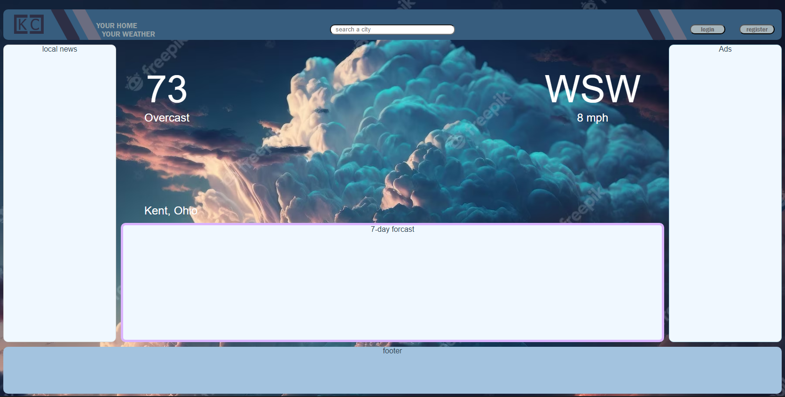

### Summarize the project and what problem it will solve.
The main goal of this project will be to allow users to view local news and weather.

### Project Details
When the user first accesses the website, their IP address is used as the search parameter for a weather API request as well as a news API request. The weather API returns the current weather and a 7 day forcast for their location. It also returns a weather code determining the background image of the webpage. Creating an account will add the ability to save multiple locations in a My Locations tab and be stored in a database. The weather and local news sections will update based on the users search. The search itself is using the Google Places API with autocomplete and will replace the IP address as the search parameter for the weather and news requests.

### Currently...
This has been an enjoyable project so far. I Love the idea of a full background image for the weather depiction instead of just a small icon. Im also happy with color scheme of the main title bar and look forward to applying it to the other components. The weather API Im using is weatherstack and is well documented and also has a free limited option. 

## Next steps...
create user login. Currently, the server is connected to a Postgres database and I would like to get the ability to save users and their prefered locations set up.  

## Roadblocks
Although this weather API has a free version, that version does not include a forcast and so far I've seen none that do. The News API is the same and even more expensive. This will also be my first time setting up ads so learning will have to occur before that happens. Another issue is the background images. The weather API can return a large variety of weather codes and both storing a large amount of corresponding Images and dynamically changing the background will be a new challenge for me. Any suggestions will be welcome!

